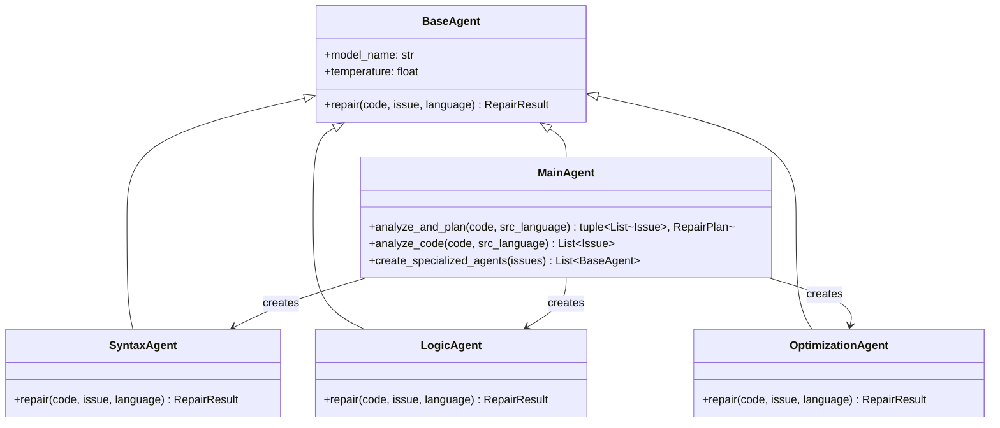
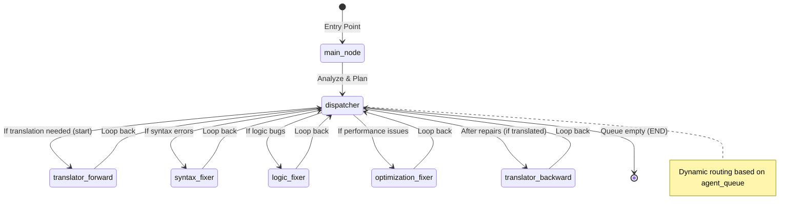
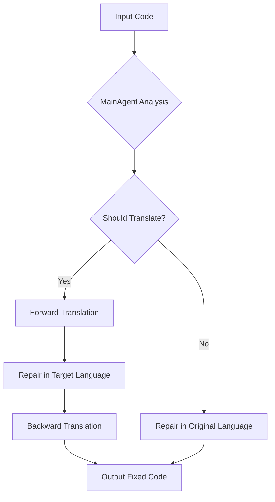
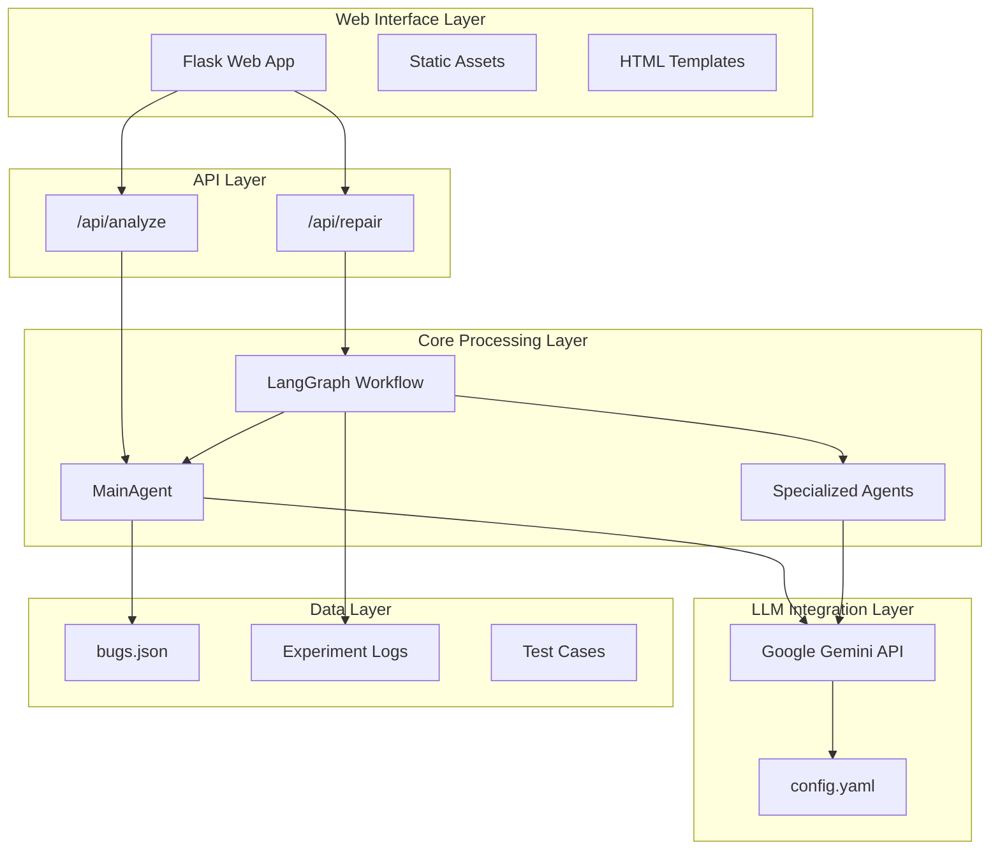
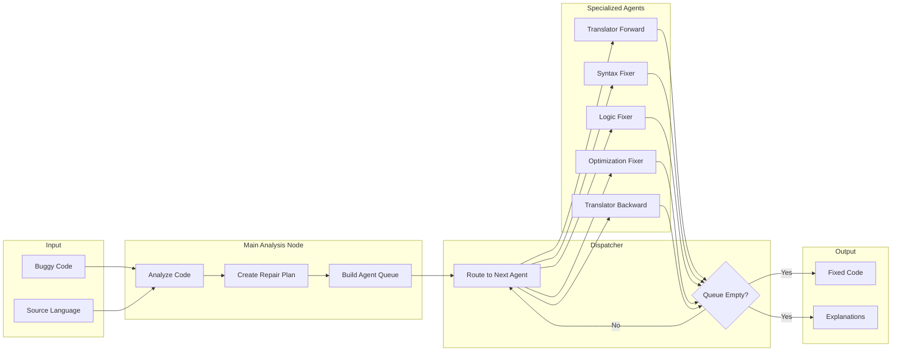
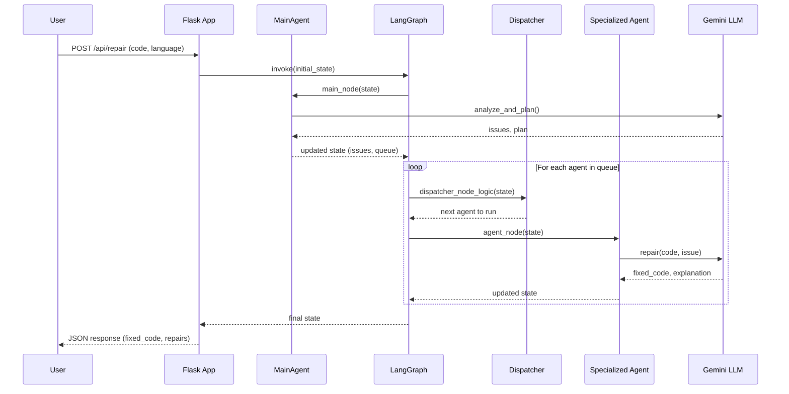
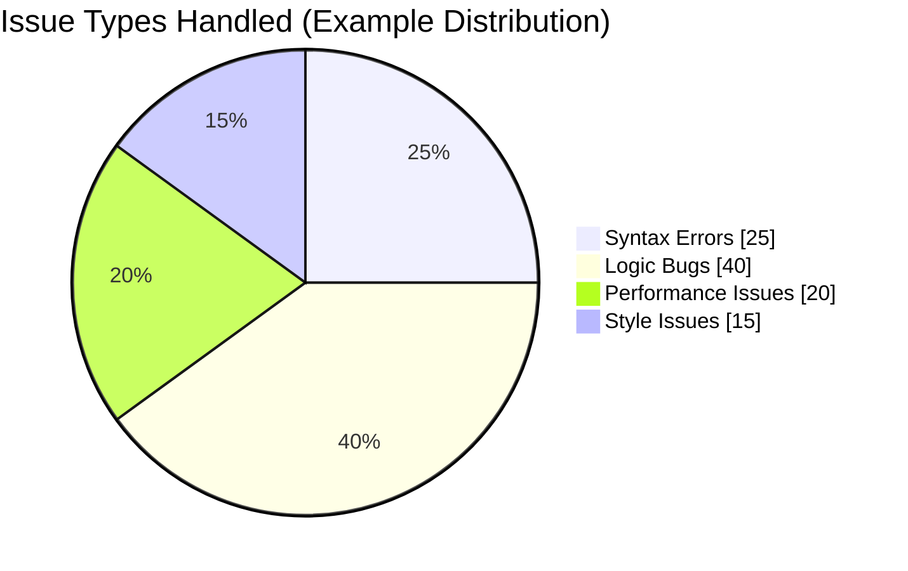
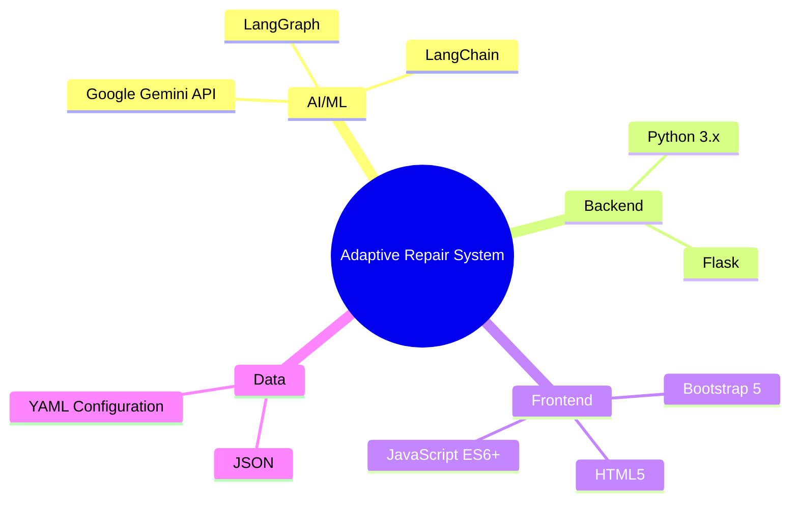
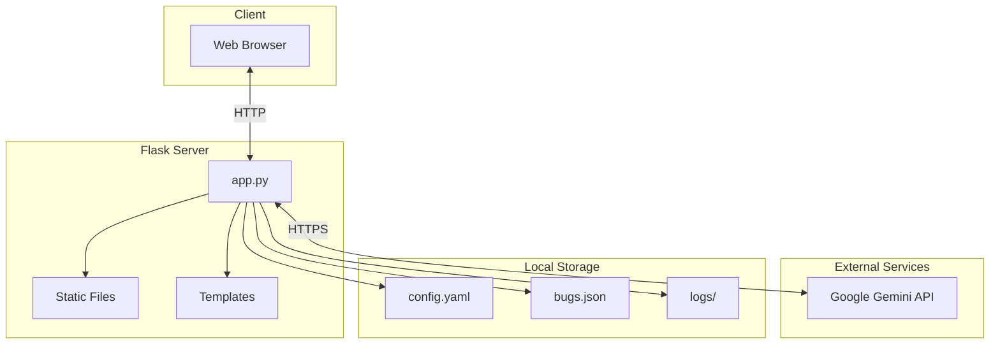

# AI-Powered Adaptive Program Repair System - Methodology & Architecture

## Overview

This document describes the main methodology and architectural design patterns used in developing the Adaptive Program Repair System. The system leverages Large Language Models (LLMs) orchestrated through a multi-agent architecture to automatically analyze and repair buggy code across multiple programming languages.

---

## Core Methodology

### 1. Multi-Agent Architecture

The system employs a **Multi-Agent System (MAS)** design pattern where specialized AI agents handle specific repair tasks. This approach enables:

- **Separation of Concerns**: Each agent focuses on a specific type of bug
- **Scalability**: New agent types can be added without modifying existing logic
- **Modularity**: Agents can be tested and improved independently

#### Key Data Structures

The system uses the following core data structures for communication between agents:

| Data Structure | Description |
|----------------|-------------|
| `Issue` | Represents a detected problem with id, type, description, and location hint |
| `RepairPlan` | High-level plan with translation decision (`translate`, `target_language`, `detected_language`, `language_match`) |
| `RepairResult` | Result from agent repair containing `fixed_code` and `explanation` |

### 2. Graph-Based Workflow Orchestration (LangGraph)

The system uses **LangGraph** to implement a state machine pattern for workflow orchestration. This provides:

- **Declarative Workflow Definition**: Clear visualization of the repair pipeline
- **Dynamic Routing**: Conditional edges enable adaptive processing paths
- **State Management**: Centralized state tracks code, issues, and repairs through the pipeline

### 3. Adaptive Translation Strategy

A unique feature is the **cross-language repair** capability. The MainAgent can decide to translate code to a different programming language if:

- The target language has better LLM repair support
- The bug pattern is easier to analyze in another language

---

## System Architecture

### High-Level Architecture

### Detailed Component Architecture

---

## Data Flow Sequence

---

## Key Design Patterns

### 1. State Machine Pattern

The LangGraph implementation uses a state machine where:
- **States**: Represented by `GraphState` TypedDict
- **Transitions**: Defined by edges between nodes
- **Conditions**: Handled by `route_dispatcher` function

### 2. Factory Pattern

The `MainAgent.create_specialized_agents()` method acts as a factory, creating appropriate agent instances based on detected issue types.

### 3. Chain of Responsibility

Issues flow through a chain of specialized agents, each handling its specific concern and passing the updated code to the next.

### 4. Observer Pattern (Logging)

The `log_experiment()` utility captures all API interactions for analysis and debugging.

---

## Issue Classification

The following diagram shows an example distribution of issue types that the system is designed to handle:

The system categorizes bugs into four main types:

| Issue Type | Handler | Description |
|------------|---------|-------------|
| `syntax_error` | SyntaxAgent | Parsing errors, missing tokens, indentation |
| `logic_bug` | LogicAgent | Wrong conditions, off-by-one, incorrect algorithms |
| `performance_issue` | OptimizationAgent | Slow code, suboptimal complexity |
| `style_issue` | LogicAgent | Generic issues handled by LogicAgent |

---

## Technology Stack

---

## Deployment Architecture

---

## Summary

The Adaptive Program Repair System represents a modern approach to automated bug fixing by combining:

1. **Multi-Agent Architecture**: Specialized agents for different bug types
2. **Graph-Based Orchestration**: LangGraph for flexible, maintainable workflows
3. **Adaptive Translation**: Cross-language repair capabilities
4. **LLM Integration**: Leveraging Google Gemini for intelligent analysis and repair

This architecture enables the system to handle diverse programming languages and bug types while maintaining clean separation of concerns and extensibility for future enhancements.
