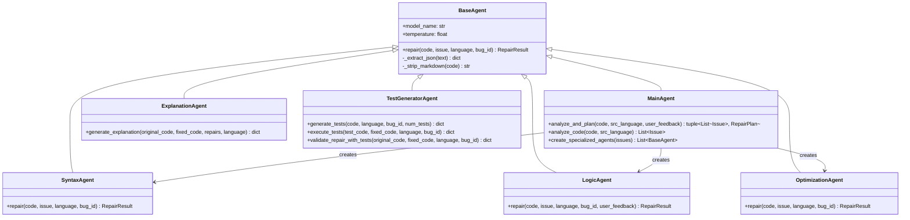
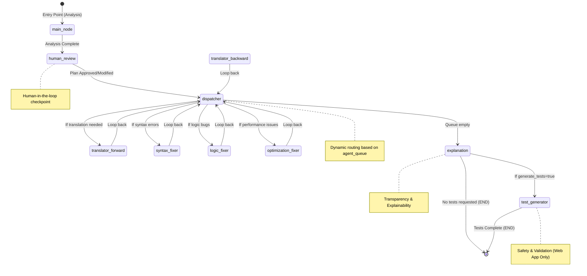
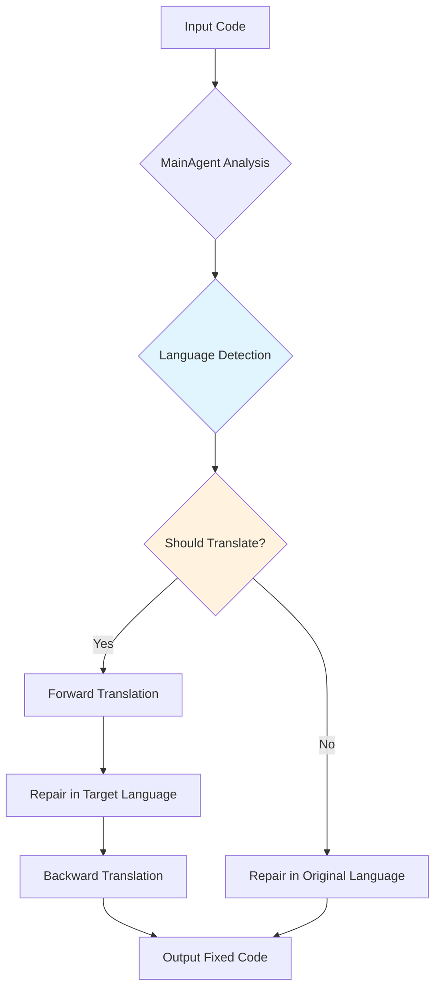
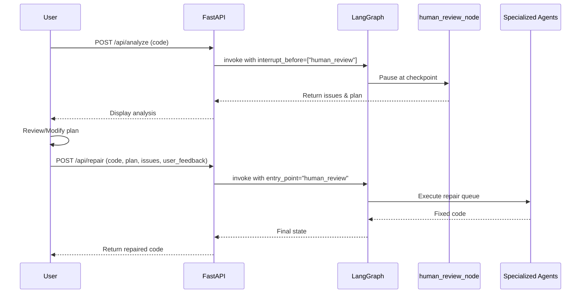
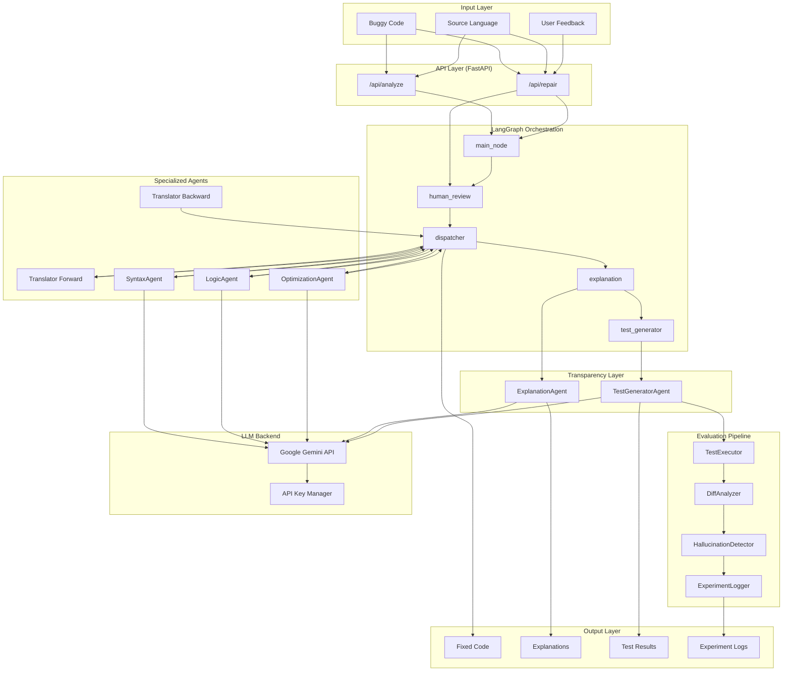
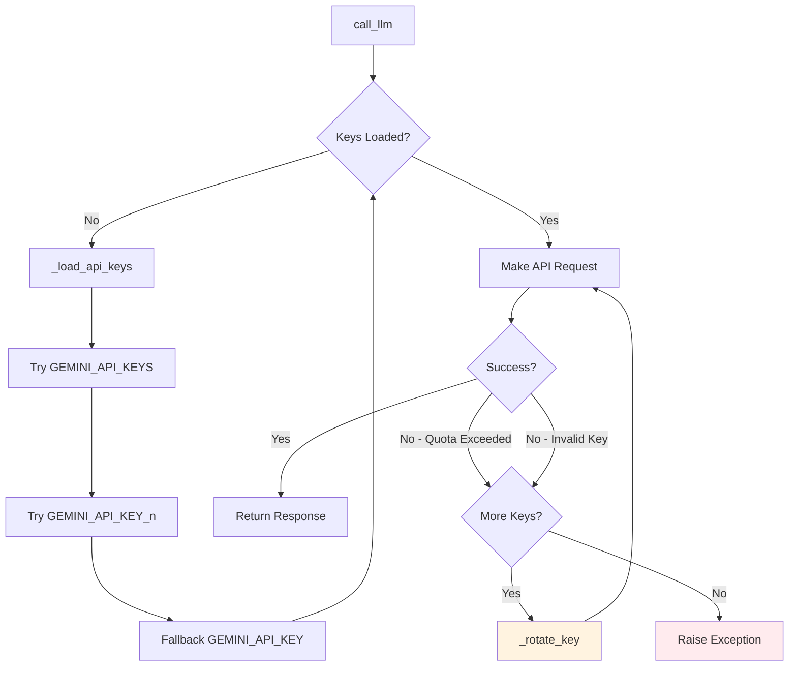
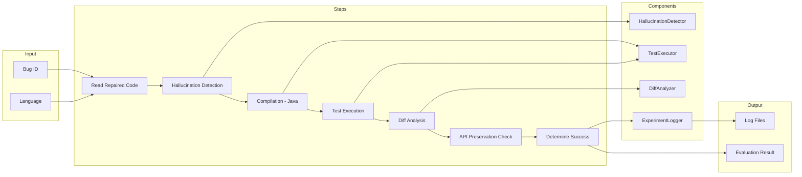
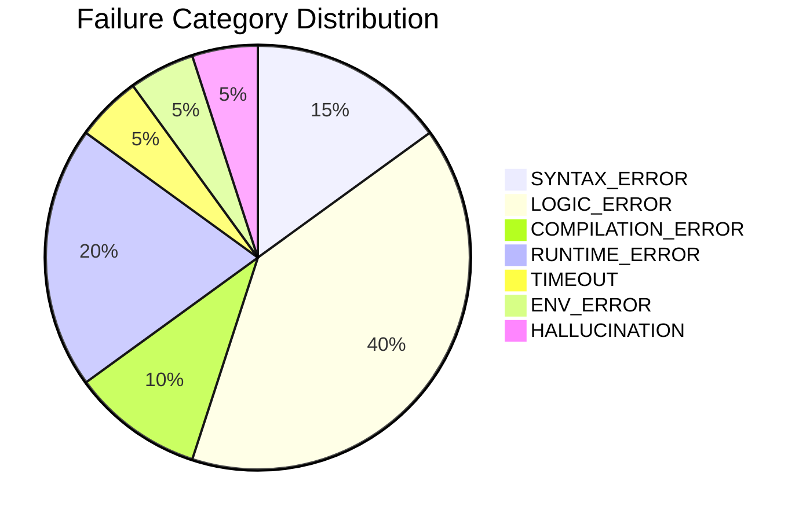
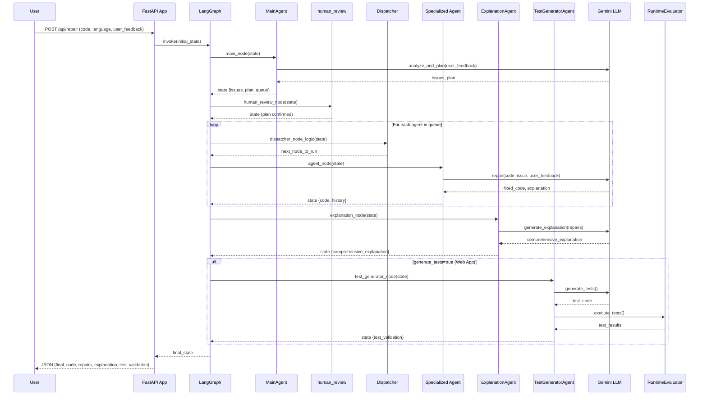

# AI-Powered Adaptive Program Repair System - Methodology & Architecture

## Overview

This document describes the main methodology and architectural design patterns used in developing the Adaptive Program Repair System. The system leverages Large Language Models (LLMs) orchestrated through a multi-agent architecture to automatically analyze and repair buggy code across multiple programming languages.

The system provides:
- **Multi-agent orchestration** for specialized bug detection and repair
- **LangGraph state machine** for flexible workflow management
- **Human-in-the-loop** capabilities for user feedback and plan modification
- **Cross-language repair** via automatic code translation
- **Comprehensive evaluation** with test execution, diff analysis, and hallucination detection
- **Web interface** via FastAPI REST API and interactive UI

---

## Core Methodology

### 1. Multi-Agent Architecture

The system employs a **Multi-Agent System (MAS)** design pattern where specialized AI agents handle specific repair tasks. This approach enables:

- **Separation of Concerns**: Each agent focuses on a specific type of bug or task
- **Scalability**: New agent types can be added without modifying existing logic
- **Modularity**: Agents can be tested and improved independently
- **Transparency**: ExplanationAgent provides human-readable repair summaries
- **Safety**: TestGeneratorAgent validates repairs through automated testing



#### Agent Descriptions

| Agent | Role | Key Capabilities |
|-------|------|------------------|
| **MainAgent** | Router & Planner | Analyzes code, classifies issues, decides translation strategy, builds repair queue |
| **SyntaxAgent** | Syntax Fixer | Fixes parsing errors, missing tokens, indentation issues |
| **LogicAgent** | Logic Fixer | Corrects wrong conditions, off-by-one errors, algorithm bugs; supports user feedback |
| **OptimizationAgent** | Performance Fixer | Optimizes slow code, reduces complexity |
| **ExplanationAgent** | Transparency | Generates comprehensive, human-readable explanations with confidence scores |
| **TestGeneratorAgent** | Validation (Web App) | Generates and executes unit tests to validate repairs |

#### Key Data Structures

The system uses the following core data structures for communication between agents:

| Data Structure | Description |
|----------------|-------------|
| `Issue` | Represents a detected problem with `id`, `type`, `description`, and `location_hint` |
| `RepairPlan` | High-level plan with translation decision (`translate`, `target_language`, `detected_language`, `language_match`) |
| `RepairResult` | Result from agent repair containing `fixed_code` and `explanation` |
| `GraphState` | TypedDict tracking entire pipeline state including `code`, `issues`, `plan`, `agent_queue`, `history`, `user_feedback`, `test_validation` |

### 2. Graph-Based Workflow Orchestration (LangGraph)

The system uses **LangGraph** to implement a state machine pattern for workflow orchestration. This provides:

- **Declarative Workflow Definition**: Clear visualization of the repair pipeline
- **Dynamic Routing**: Conditional edges enable adaptive processing paths
- **State Management**: Centralized state tracks code, issues, and repairs through the pipeline
- **Interruption Support**: Human-in-the-loop via `interrupt_before`/`interrupt_after` for plan review
- **Flexible Entry Points**: Can start from `main_node` (full analysis) or `human_review` (with pre-provided plan)



#### Graph Nodes

| Node | Function | Purpose |
|------|----------|---------|
| `main_node` | `main_node()` | Invokes MainAgent for analysis, constructs repair queue |
| `human_review` | `human_review_node()` | Checkpoint for user plan approval/modification |
| `dispatcher` | `dispatcher_node_logic()` | Pops next agent from queue, routes to appropriate fixer |
| `translator_forward` | `translator_forward_node()` | Translates code to target language |
| `syntax_fixer` | `syntax_fixer_node()` | Invokes SyntaxAgent |
| `logic_fixer` | `logic_fixer_node()` | Invokes LogicAgent (with optional user feedback) |
| `optimization_fixer` | `optimization_fixer_node()` | Invokes OptimizationAgent |
| `translator_backward` | `translator_backward_node()` | Translates code back to original language |
| `explanation` | `explanation_node()` | Invokes ExplanationAgent for comprehensive summary |
| `test_generator` | `test_generator_node()` | Invokes TestGeneratorAgent for validation (conditional) |

### 3. Adaptive Translation Strategy

A unique feature is the **cross-language repair** capability. The MainAgent can decide to translate code to a different programming language if:

- The target language has better LLM repair support
- The bug pattern is easier to analyze in another language
- The detected language differs from the declared source language



### 4. Human-in-the-Loop (HITL) Support

The system supports **user feedback integration** at multiple points:

1. **Plan Review**: The `human_review` node allows users to approve, reject, or modify the repair plan
2. **User Feedback in Repair**: The `user_feedback` field in state is passed to agents (especially LogicAgent) to guide repairs
3. **Iterative Refinement**: Users can reject repairs and provide specific feedback for re-analysis



---

## System Architecture

### Detailed Component Architecture



### API Key Management

The system implements **automatic API key rotation** for resilience:



Key sources (in order of priority):
1. `GEMINI_API_KEYS` - Comma-separated list
2. `GEMINI_API_KEY_1`, `GEMINI_API_KEY_2`, ... - Indexed keys
3. `GEMINI_API_KEY` - Single key (or comma-separated fallback)

---

## Evaluation System

### Dual Evaluation Pipelines

The system provides two evaluation modes:

| Pipeline | Use Case | Features |
|----------|----------|----------|
| **EvaluationPipeline** | Batch evaluation with ground truth | Test execution, diff checking, API preservation |
| **RuntimeEvaluationPipeline** | Web app (no ground truth) | Sandbox execution, hallucination detection, failure analysis |

### EvaluationPipeline (Batch Mode)



### Hallucination Detection

Detects common LLM output issues:

| Check | Java | Python | Severity |
|-------|------|--------|----------|
| Markdown fences in code | ✓ | ✓ | Critical |
| Class name mismatch | ✓ | - | High |
| Missing package declaration | ✓ | - | High |
| Generic placeholder names | ✓ | - | High |
| Duplicate class definitions | ✓ | - | Critical |
| Mismatched braces/parentheses | ✓ | ✓ | Critical |
| Explanation text in code | - | ✓ | High |
| Incomplete placeholders | - | ✓ | High |

### Failure Analysis Categories



| Category | Description | Detection Method |
|----------|-------------|------------------|
| `SYNTAX_ERROR` | Code parsing failures | Syntax validation |
| `LOGIC_ERROR` | Assertion failures in tests | Test execution |
| `COMPILATION_ERROR` | Java compilation failures | javac exit code |
| `RUNTIME_ERROR` | Code crashes during execution | Exception handling |
| `TIMEOUT` | Infinite loops, inefficiency | Timeout thresholds |
| `ENV_ERROR` | Missing dependencies | Import error detection |
| `HALLUCINATION` | Invalid LLM artifacts | Pattern matching |

---

## Data Flow Sequence

### Complete Repair Flow with Test Generation



---

## Web Application

### FastAPI Endpoints

| Endpoint | Method | Description |
|----------|--------|-------------|
| `/` | GET | Serve web UI (index.html) |
| `/api/analyze` | POST | Run analysis phase only (with HITL checkpoint) |
| `/api/repair` | POST | Run full repair pipeline |

### Request/Response Models

#### AnalyzeRequest
```python
{
    "code": str,           # Buggy code to analyze
    "language": str,       # Source language (default: "Python")
    "user_feedback": str,  # Optional feedback from previous attempt
    "request_id": str      # Optional tracking ID
}
```

#### AnalyzeResponse
```python
{
    "issues": [
        {
            "id": int,
            "type": str,           # syntax_error | logic_bug | performance_issue | style_issue
            "description": str,
            "location_hint": str
        }
    ],
    "plan": {
        "translate": bool,
        "target_language": str,
        "detected_language": str,
        "language_match": bool
    },
    "execution_steps": [
        {"step": int, "type": str, "description": str}
    ]
}
```

#### RepairRequest
```python
{
    "code": str,
    "language": str,
    "user_feedback": str,  # Optional: Guide repair with specific feedback
    "request_id": str,
    "plan": dict,          # Optional: Modified plan from /api/analyze
    "issues": list         # Optional: Modified issues from /api/analyze
}
```

#### RepairResponse
```python
{
    "original_code": str,
    "final_code": str,
    "repairs": [
        {
            "issue_id": int,
            "type": str,
            "description": str,
            "fixed_code": str,
            "explanation": str
        }
    ],
    "plan": dict,
    "translation": {
        "used": bool,
        "from_language": str,
        "to_language": str,
        "forward_translated_code": str,
        "final_language": str
    },
    "comprehensive_explanation": {
        "summary": str,
        "detailed_explanations": list,
        "confidence_score": int,
        "risks": list,
        "transparency_notes": str
    },
    "test_validation": {
        "tests": dict,
        "validation": dict,
        "execution": dict,
        "analysis": dict,
        "hallucinations": list
    }
}
```

---

## Key Design Patterns

### 1. State Machine Pattern

The LangGraph implementation uses a state machine where:
- **States**: Represented by `GraphState` TypedDict
- **Transitions**: Defined by edges between nodes
- **Conditions**: Handled by `route_dispatcher` and `route_to_test_generation` functions
- **Interrupts**: Support for human-in-the-loop via `interrupt_before`/`interrupt_after`

### 2. Factory Pattern

The `MainAgent.create_specialized_agents()` method acts as a factory, creating appropriate agent instances based on detected issue types.

### 3. Chain of Responsibility

Issues flow through a chain of specialized agents, each handling its specific concern and passing the updated code to the next.

### 4. Observer Pattern (Logging)

Multiple loggers capture different aspects:
- `log_experiment()` - API interactions
- `ExperimentLogger` - Batch evaluation results
- `RuntimeLogger` - Web app runtime evaluations

### 5. Strategy Pattern

The evaluation system uses different strategies based on context:
- `EvaluationPipeline` for batch mode with ground truth
- `RuntimeEvaluationPipeline` for web app without ground truth

---

## Bugs Classification

The system categorizes bugs into four main types:

| Issue Type | Handler | Description |
|------------|---------|-------------|
| `syntax_error` | SyntaxAgent | Parsing errors, missing tokens, indentation |
| `logic_bug` | LogicAgent | Wrong conditions, off-by-one, incorrect algorithms |
| `performance_issue` | OptimizationAgent | Slow code, suboptimal complexity |
| `style_issue` | LogicAgent | Generic issues handled by LogicAgent |

---

## Configuration

All model configuration is centralized in `config.yaml`:

```yaml
models:
  router: "gemini-2.5-flash"          # MainAgent model
  simple_fixer: "gemini-2.5-flash"    # Simple repairs
  complex_fixer: "gemini-2.5-flash"   # Complex repairs
  complex_analyzer: "gemini-2.5-flash" # Deep analysis
  translator: "gemini-2.5-flash"       # Code translation
  planner: "gemini-2.5-flash"          # Repair planning
  worker: "gemini-2.5-flash"           # Default worker agent
  expert_worker: "gemini-2.5-flash"    # Expert-level repairs

parameters:
  temperature: 0.2  # LLM sampling temperature
```

---

## Summary

The Adaptive Program Repair System represents a modern approach to automated bug fixing by combining:

1. **Multi-Agent Architecture**: Specialized agents (Main, Syntax, Logic, Optimization, Explanation, TestGenerator) for different tasks
2. **Graph-Based Orchestration**: LangGraph state machine with dynamic routing and human-in-the-loop support
3. **Adaptive Translation**: Cross-language repair capabilities with automatic language detection
4. **LLM Integration**: Google Gemini with automatic API key rotation and error handling
5. **Comprehensive Evaluation**: Dual pipelines for batch and runtime evaluation with hallucination detection
6. **Transparency & Safety**: ExplanationAgent for explainability, TestGeneratorAgent for validation
7. **Web Interface**: FastAPI-powered REST API with interactive endpoints

This architecture enables the system to:
- Handle diverse programming languages (Python, Java) and bug types
- Maintain clean separation of concerns and extensibility
- Support human oversight and feedback integration
- Provide comprehensive logging and evaluation capabilities
- Scale through modular agent design and flexible workflow configuration
